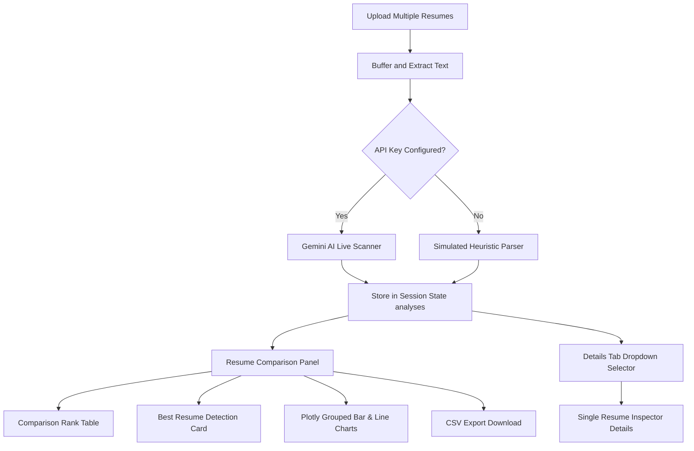

# Build an AI Multi-Resume Analyzer & Career Coach with Python, Streamlit, and Gemini AI

Tired of sending out resumes into the job search void? In today’s competitive market, candidate screening systems filter out over 98% of applications before they reach hiring managers. Often, job seekers need to modify their resume multiple times (V1, V2, V3) or compare different resumes side-by-side to see which version best fits a target description.

In this tutorial, we will build a production-quality, commercial-grade **AI Multi-Resume Analyzer & Career Coach** using Python, Streamlit, and Google’s Gemini AI. This upgraded system allows you to upload multiple resumes simultaneously, compare them in a ranking table, highlight the best overall resume, track score metrics and versions over time using Plotly, and export the comparison data to CSV.

---

## 🎯 What We Are Building
Here is the multi-resume flow architecture:



---

## 🛠️ Step 1: Project Dependencies

Ensure you have your environment activated and dependencies installed. Your `requirements.txt` should contain:

```text
streamlit
google-generativeai
python-dotenv
pypdf
python-docx
plotly
pandas
```

Install them with:
```bash
pip install -r requirements.txt
```

---

## 📝 Step 2: Implementation Details

Create or update your `app.py`. The key architectural blocks for handling multiple files include:

### 1. File Upload Handler
In Streamlit, set `accept_multiple_files=True` on `st.file_uploader` to retrieve a list of uploaded file buffers:

```python
uploaded_files = st.file_uploader(
    "Upload one or more PDF/Word DOCX resumes:", 
    type=["pdf", "docx"], 
    accept_multiple_files=True
)
```

### 2. Multi-Resume State Management
We check if the files are already analyzed in the `st.session_state.analyses` dictionary, running the AI parser only on newly added files to save API costs:

```python
if uploaded_files:
    uploaded_filenames = [f.name for f in uploaded_files]
    # Remove files that are no longer uploaded
    for key in list(st.session_state.analyses.keys()):
        if key not in uploaded_filenames:
            del st.session_state.analyses[key]
            
    unprocessed_files = [f for f in uploaded_files if f.name not in st.session_state.analyses]
```

### 3. Comparison Metrics & Table Generation
When multiple resumes are processed, we compile subscores into a Pandas DataFrame and render an interactive tabular comparative view:

```python
rows_list = []
for name, data in st.session_state.analyses.items():
    breakdown = data["score_breakdown"]
    rows_list.append({
        "Resume Name": name,
        "ATS Score": data["ats_score"],
        "Keyword Match": breakdown["keywords"],
        "Formatting": breakdown["formatting"],
        "Experience": breakdown["experience"]
    })
df_comp = pd.DataFrame(rows_list).sort_values(by="ATS Score", ascending=False)
st.dataframe(df_comp)
```

### 4. Interactive Plotly Charts
- **Grouped Bar Charts**: Render category scores (Keywords, Formatting, Experience) for all files side-by-side.
- **Line Progress Charts**: Display improvement progress across versions (V1, V2, V3) to show how changes raise compatibility.

---

## 🚀 Step 3: Launch the Application

Run the server command:

```bash
streamlit run app.py
```

Open **`http://localhost:8501`** in your browser.

---

## 📊 Expected Outputs & Visual Walkthrough

### 1. Comparison Dashboard
- **Rank Standings**: A sortable table ranking files from best match to worst match.
- **Trophy Cards**: Displaying "🏆 Best Overall Resume" and explaining the selection.
- **Plotly Visuals**: Interactive grouped bar graphs comparing subscores and version tracking lines showing score growth over time.
- **Data Export**: Clickable button to download the comparison standings immediately as a `.csv` spreadsheet.

### 2. Single-Resume Inspector Tabs
- Change the dropdown **`🔎 Select Resume to Inspect Detailed Tab Content:`** to update individual feedback.
- Tabs like **`✨ Resume Rewriter`** or **`🧠 Career Roadmaps`** automatically refresh to display details for the selected resume.

---

## 💡 Key Coding Concepts Learned
- **Multi-File Handling**: Handling list buffers in Streamlit uploads.
- **Session Caching**: Storing key-value pairs of analyzed outputs.
- **Plotly Grouping**: Rendering multiple visual series in a single barmode chart.
- **Pandas Manipulation**: Sorting, ranking, and exporting DataFrame metrics to CSV byte streams.
